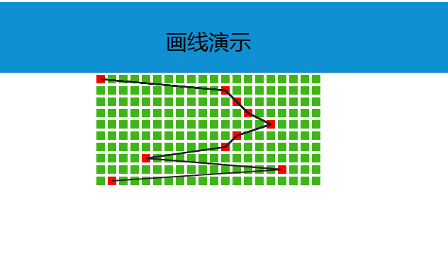

# drawLine

# 一个可以将dom元素连线的组件,适用于彩票的中奖号码趋势等,类似棋盘式的表格上连线的工具函数

# 使用方法:参考index.html
``` javascropt
    var panel = 'table'; //容器的选择器
    var select = '.select'; //要连接的目标选选择器
    var lineWidth = 2; //线的宽度
    var style = "#222"; //线的样式
    drawBrokenLine(panel,select,lineWidth,style);
 ```
 
 
